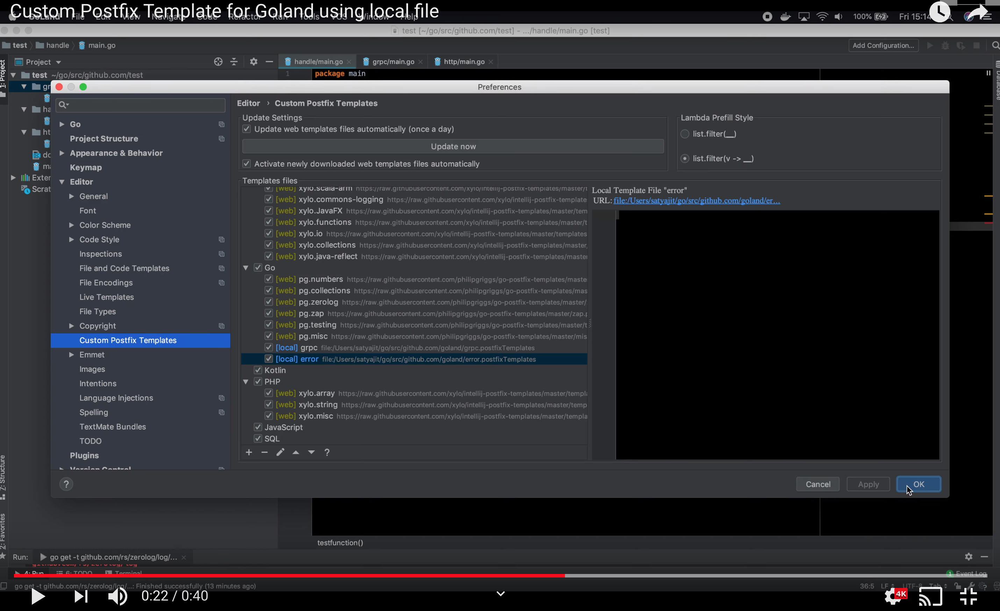

**Custom Postfix Template for Goland using local file**

Custom Postfix Templates for Go to be used in Goland. 

Follow the following procedure to get these templates included in your Goland: 

0. Save these files locally or Create your own custom template file
1. Go to Goland - Preferences - Editor - Custom Postfix Templates
2. Under "Templates files" click on the + button
3. Select "Go"
4. Under "Type" select "Local file in file system"
5. Give URL of the file
6. Click "OK"

This video shows a screen recording of the above process: 

Of course there is another way of getting the same result and ths is by adding the official plugin. But this repository shows how to do your own customization if you don't want to wait for these to be available in the official Goland templates. 